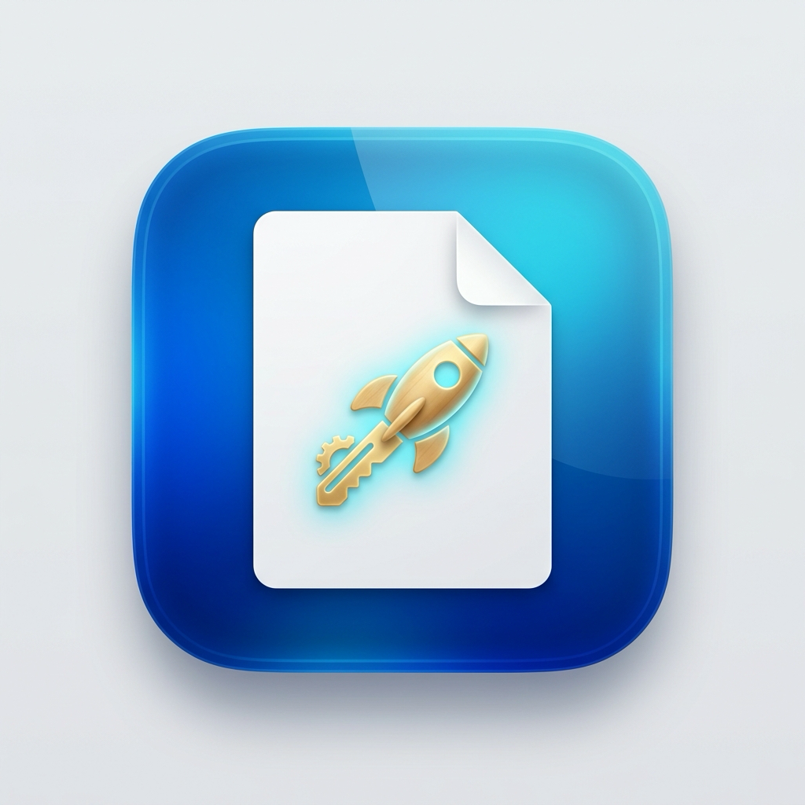

<div align="center">



# FinderToys 🛠️
### The Ultimate PowerToys Utility for macOS Finder
**Enter to Open • F2 to Rename • ⌘V Paste to File • Video & Word Converters • PDF Tools • Right-Click New File Menu**

**English** | [Русский](README.ru.md)

[](https://apple.com)
[](#)
[](./LICENSE)
[](#)
[](https://github.com/atlant63/FinderToys/stargazers)

<br/>

### ⬇️ **[Download FinderToys.dmg (942 KB)](https://github.com/atlant63/FinderToys/releases/download/v2.0.0/FinderToys.dmg)**
*(Free & Open Source for Apple Silicon M1/M2/M3/M4 & Intel)*

</div>

---

**FinderToys** is a native, ultra-lightweight macOS productivity toolkit designed to fix the biggest pain points of Apple's Finder. It introduces essential desktop features familiar to Windows switchers and power users: **Enter to open files**, **F2 to rename**, **Cmd+V to save clipboard images and text directly as files**, a **custom right-click "New File" context menu**, plus built-in **video compression & GIF maker**, **Word-to-PDF conversion**, and **PDF merging**.

Unlike heavy Electron alternatives, FinderToys is crafted with pure Objective-C and AppKit, consuming **0% CPU** and under **15 MB of RAM**.

---

## ⚡ Quick Installation

### Option 1: One-Line Terminal Command (Fastest)
Install and launch FinderToys in seconds without opening a browser:
```bash
curl -fsSL https://raw.githubusercontent.com/atlant63/FinderToys/main/install.sh | bash
```

### Option 2: Drag-and-Drop DMG
1. Download **[`FinderToys.dmg`](https://github.com/atlant63/FinderToys/releases/download/v2.0.0/FinderToys.dmg)**.
2. Open the disk image and drag **FinderToys** to your **Applications** folder.
3. Launch **FinderToys** from Applications or Spotlight.

---

## 📊 FinderToys vs. Default macOS Finder

| Feature | Default macOS Finder | Microsoft Windows | 🛠️ **FinderToys** |
| :--- | :---: | :---: | :---: |
| **<kbd>Enter</kbd> (Return) Action** | Renames item (frustrating) | Opens item | **Opens selected file or folder** |
| **Rename Shortcut** | <kbd>Enter</kbd> | <kbd>F2</kbd> | **<kbd>F2</kbd>, <kbd>⌥ Option + F2</kbd>, <kbd>⌘R</kbd>** |
| **Paste Image as File (<kbd>⌘V</kbd>)** | ❌ Not supported | ❌ Third-party required | **✅ Auto-saves as `image.png`** |
| **Paste Text as File (<kbd>⌘V</kbd>)** | ❌ Not supported | ❌ Third-party required | **✅ Auto-saves as `Clipboard.txt`** |
| **Right-Click "New File" Menu** | ❌ Not supported | ✅ Built-in | **✅ Office, iWork, Text, Markdown, JSON** |
| **Copy Path without Quotes** | ⚠️ Clunky shortcut | ⚠️ Manual copy | **✅ One-click clean POSIX path** |
| **Open Terminal at Current Folder** | ⚠️ Multi-step service setup | ✅ Address bar trick | **✅ One-click context menu item** |
| **Video Compression & GIF** | ❌ None | ❌ Third-party required | **✅ H.264 CRF 22 Compress, MP4, MOV, GIF** |
| **Word to PDF / TXT / DOCX** | ❌ Requires MS Office | ❌ Requires MS Office | **✅ Native in-process conversion** |
| **Merge into Single PDF** | ⚠️ Clunky Quick Actions | ❌ Third-party required | **✅ 1-click merge images & PDFs** |
| **Memory & Battery Impact** | High (third-party Electron apps) | N/A | **⚡ Native AppKit (~0% CPU, <15 MB RAM)** |

---

## ✨ Core Features Explained

### 1. ⌨️ Natural Keyboard Navigation: Enter to Open & F2 to Rename
Coming from Windows or Linux, pressing <kbd>Enter</kbd> in macOS Finder only renames the file instead of opening it. FinderToys restores intuitive keyboard behavior:
* **Press <kbd>Enter</kbd>:** Opens the selected file in its default application, or navigates inside the selected folder.
* **Press <kbd>F2</kbd>, <kbd>⌥ Option + F2</kbd>, or <kbd>⌘ Cmd + R</kbd>:** Instantly triggers in-line renaming.
* **Secondary Rename Keys:** Also supports <kbd>⇧ Shift + Enter</kbd> and <kbd>⌥ Option + Enter</kbd>.
* **Smart Typing Protection:** When editing a text field (renaming files, typing in Finder's search box, or using "Go to Folder"), <kbd>Enter</kbd> and <kbd>⌘V</kbd> operate normally so your text input is never interrupted.

### 2. 📋 Smart Clipboard to File (<kbd>⌘ Cmd + V</kbd>)
Never open Preview, Photoshop, or a text editor just to save what you copied. Simply press <kbd>⌘V</kbd> in any active Finder window or on your Desktop:
* **Screenshots & Images:** Copied an image from the web or taken a screenshot? Press <kbd>⌘V</kbd> to save it directly as `image.png`. Existing files won't be overwritten—FinderToys auto-increments names (`image 2.png`, `image 3.png`, etc.).
* **Code & Plain Text:** Copied a terminal command, code block, or snippet? Press <kbd>⌘V</kbd> to generate `Clipboard.txt`.
* **JSON Formatting:** Copied JSON objects or arrays? Press <kbd>⌘V</kbd> to generate `Clipboard.json`.
* **Web Links:** Copied a URL? Press <kbd>⌘V</kbd> to create a native macOS `.webloc` internet shortcut.
* **Active Folder Awareness:** Automatically detects the exact open folder (Downloads, Documents, external USB/SSD drives, or Desktop) and selects the new file immediately.
* **Zero Interference:** Standard file/folder copy-paste in Finder is completely preserved.

### 3. 🖱️ Right-Click Context Menu (Finder Sync Integration)
Right-click anywhere on empty space in Finder or on your Desktop:
* **New File:** Instant creation of pre-formatted blank documents:
  * **Text & Code:** Plain Text (`.txt`), Markdown (`.md`), JSON (`.json`)
  * **Microsoft Office:** Word (`.docx`), Excel (`.xlsx`), PowerPoint (`.pptx`)
  * **Apple iWork:** Pages (`.pages`), Numbers (`.numbers`), Keynote (`.key`)
* **Copy Path:** Copies the clean POSIX file or directory path directly to clipboard without surrounding quotes.
* **Open Terminal:** Launches Terminal directly at the current directory.

### 4. 🔄 Smart Format & File Converters (Dynamic Context Submenus)
Context menu actions automatically appear only when relevant files are selected, keeping Finder clean:

* **🖼️ Image Tools (PNG, JPG, HEIC, WebP, TIFF, BMP):**
  * **to PNG / to JPEG / to HEIC:** 1-click format conversion (current format is automatically excluded).
  * **to PDF:** Convert a single photo directly into a vector PDF page.
  * **Combine into PDF:** Select 2+ photos or scans to merge them into a single PDF.
* **🎬 Video Tools (MP4, MOV, MKV, AVI, WebM, etc.):**
  * **Compress (H.264):** High-efficiency video compression via ffmpeg (CRF 22, fast preset, tune film, faststart) or native AVAssetExport fallback. Originals are never touched.
  * **to MP4 / to MOV:** Fast format conversion with smart filtering.
  * **to GIF:** High-quality two-pass palette GIF generator (12 fps, lanczos scaling up to 720p, bayer dithering).
* **📄 Word & Document Tools (.docx, .doc, .rtf, .odt):**
  * **Convert ▸ to PDF:** Multi-page A4 vector PDF rendering with selectable text and standard margins directly through AppKit TextKit and PDFKit (no Microsoft Office or LibreOffice required).
  * **Convert ▸ to TXT:** Instant plain-text extraction.
  * **Convert ▸ to DOCX:** Upgrade legacy `.doc`, `.rtf`, or `.odt` files to modern `.docx`.
* **📑 PDF Tools:**
  * **Merge PDFs:** Select 2 or more PDF documents to merge them into one unified file in seconds.

### 5. 🌐 Menu Bar & Preferences
* Status bar icon with clean categorized toggles:
  * **Finder Shortcuts:** Toggle Enter to open & ⌘V paste to file.
  * **Context Converters:** Enable/disable Image, Video, or Document & PDF tools independently.
  * **Conversion Options:** Option to move original files to Trash after format conversion (never affects compress, GIF, PDF, or Word).
  * **Real-time Accessibility Status:** Shows `✅ Accessibility: Granted` or a one-click button to grant permission.
* **Bilingual Automatic Language Detection:**
  * Native **Russian** on Russian macOS configurations (`ru-RU`, `ru-UZ`, etc.).
  * Native **English** for international users.

---

## 🔒 macOS Permissions & Setup

To intercept Finder keystrokes and display context menus, FinderToys requires two standard macOS permissions:

1. **Accessibility (for Enter, F2, and ⌘V hotkeys):**
   * Open **System Settings** → **Privacy & Security** → **Accessibility**.
   * Toggle **FinderToys** to **ON**.
2. **Finder Extension (for Right-Click Context Menu):**
   * Open **System Settings** → **General** → **Login Items & Extensions** → **Finder Extensions**.
   * Toggle **FinderToys Extension** to **ON**.

---

## ❓ Frequently Asked Questions (FAQ)

### How do I make Enter open files on Mac like in Windows?
Install FinderToys. It automatically rebinds <kbd>Enter</kbd> to open selected files and folders in macOS Finder, while remapping <kbd>F2</kbd>, <kbd>Option + F2</kbd>, and <kbd>⌘R</kbd> for file renaming.

### How do I paste a copied image directly into Finder as a PNG?
Copy any image to your clipboard from a browser or screenshot tool, switch to Finder, and press <kbd>⌘V</kbd>. FinderToys instantly writes `image.png` to the active directory.

### How do I convert Word documents to PDF without Microsoft Office?
Select one or more `.docx`, `.doc`, `.rtf`, or `.odt` files in Finder, right-click, and choose **Convert ▸ to PDF**. FinderToys creates multi-page A4 PDFs in the same folder natively.

### Does FinderToys drain battery or slow down my Mac?
No. FinderToys is written in native Objective-C with event tap filtering. It uses 0% CPU at idle and takes less than 15 MB of memory.

---

## 🛠️ Building from Source

Requirements: macOS 13.0+ and Apple Command Line Tools (`xcode-select --install`).

```bash
git clone git@github.com:atlant63/FinderToys.git
cd FinderToys
./build.sh -d -i
```
* `-d`: Compiles and builds `dist/FinderToys.dmg`.
* `-i`: Installs and registers the app in `/Applications/FinderToys.app`.

---

## 📄 License

FinderToys is licensed under the GNU General Public License v3.0. See [LICENSE](./LICENSE) for details.
