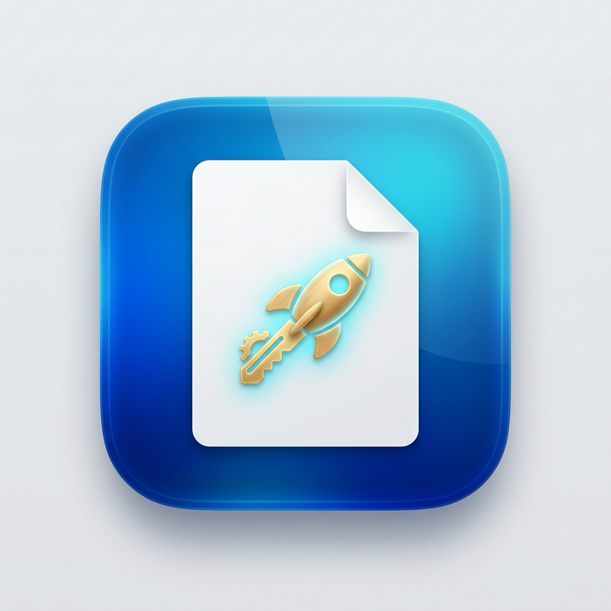

<div align="center">



# FinderToys 🛠️
**Набор полезных утилит и горячих клавиш для macOS Finder.**

[English](README.md) | **Русский**

[](https://apple.com)
[](#)
[](./LICENSE)
[](#)

<br/>

### ⬇️ **[Скачать FinderToys.dmg (942 КБ)](https://github.com/Danikk13/FinderToys/releases/download/v2.0.0/FinderToys.dmg)**
*(Прямая ссылка на готовый установочный образ)*

</div>

---

## ⚡ Быстрая установка

### Способ 1: Установка одной командой в Терминале (Рекомендуется)
Откройте «Терминал» и вставьте команду:
```bash
curl -fsSL https://raw.githubusercontent.com/Danikk13/FinderToys/main/install.sh | bash
```

### Способ 2: Установка через DMG-образ
1. Скачайте **[`FinderToys.dmg`](https://github.com/Danikk13/FinderToys/releases/download/v2.0.0/FinderToys.dmg)**.
2. Откройте загруженный `.dmg` и перетащите иконку **FinderToys** в папку **«Программы»**.
3. Запустите **FinderToys** из Программ.

---

## ✨ Возможности

### ⌨️ Интуитивные горячие клавиши
| Действие | Сочетание клавиш | Описание |
| :--- | :--- | :--- |
| **Открыть файл/папку** | <kbd>Enter</kbd> (Return) | Мгновенно открывает выбранный элемент вместо его переименования. |
| **Переименовать** | <kbd>F2</kbd>, <kbd>⌥ Option + F2</kbd>, <kbd>⌘ Cmd + R</kbd> | Запускает стандартное системное переименование без задержек. |
| **Доп. переименование** | <kbd>⇧ Shift + Enter</kbd>, <kbd>⌥ Option + Enter</kbd> | Альтернативные сочетания для быстрого переименования. |

> [!NOTE]
> **Умная защита ввода:** При наборе текста (когда вы редактируете имя файла, ищете через Spotlight в Finder или вводите путь) клавиши <kbd>Enter</kbd> и <kbd>⌘V</kbd> работают в обычном текстовом режиме и не перехватываются.

---

### 📋 Умная вставка из буфера (<kbd>⌘ Cmd + V</kbd>)
Нажмите <kbd>⌘V</kbd> в любой открытой папке Finder или на Рабочем столе:

* **Картинки:** Скопировали скриншот или изображение из браузера? Нажмите <kbd>⌘V</kbd> — файл мгновенно сохранится как `image.png` (с авто-нумерацией: `image 2.png`, `image 3.png`...).
* **Текст и код:** Скопировали фрагмент кода или текст? Нажмите <kbd>⌘V</kbd> — создастся текстовый файл `Clipboard.txt`.
* **JSON:** Скопировали данные JSON? Нажмите <kbd>⌘V</kbd> — сохранится файл `Clipboard.json`.
* **Веб-ссылки:** Скопировали URL-адрес? Нажмите <kbd>⌘V</kbd> — создастся ярлык сайта `.webloc`.
* **Автоопределение открытой папки:** Файл создается именно в той папке, которая сейчас активна в Finder (Загрузки, Документы, внешний SSD/флешка или Рабочий стол) и сразу подсвечивается.
* **Без конфликтов:** Если скопированы обычные файлы или папки в Finder, утилита не вмешивается и выполняется стандартная системная вставка.

---

### 🖱️ Контекстное меню по правому клику (ПКМ)
Кликните правой кнопкой мыши в любом месте Finder или на Рабочем столе:
1. **Новый файл:** Создание готовых чистых документов шаблонов:
   * **Текстовые:** Обычный текст (`.txt`), Markdown (`.md`), JSON (`.json`)
   * **Microsoft Office:** Word (`.docx`), Excel (`.xlsx`), PowerPoint (`.pptx`)
   * **Apple iWork:** Pages (`.pages`), Numbers (`.numbers`), Keynote (`.key`)
2. **Скопировать путь:** Копирует чистый POSIX-путь к файлу без лишних окружающих кавычек.
3. **Открыть терминал:** Мгновенно открывает Терминал прямо в текущей папке.

---

### 🌐 Строка меню и автоопределение языка
* Лаконичная иконка в строке меню с переключателями горячих клавиш.
* **Автоматический язык:** Если macOS на русском языке — интерфейс полностью на русском. На остальных системах автоматически включается английский.

---

## 🔒 Настройка разрешений macOS

Для работы утилите требуются два стандартных разрешения macOS:

1. **Универсальный доступ (для клавиш Enter, F2 и ⌘V):**
   * Перейдите в **Системные настройки** → **Конфиденциальность и безопасность** → **Универсальный доступ**.
   * Включите тумблер напротив **FinderToys** (или `MacNewFile`).
2. **Расширение Finder (для контекстного меню):**
   * Перейдите в **Системные настройки** → **Основные** → **Объекты входа и расширения** → **Расширения Finder**.
   * Включите расширение **FinderToys**.

---

## 🛠️ Сборка из исходников

Требуется: macOS 13.0+ и инструменты разработчика (`xcode-select --install`).

```bash
git clone git@github.com:Danikk13/FinderToys.git
cd FinderToys
./build.sh -d -i
```
* `-d`: Создает установочный DMG-образ в папке `dist/`.
* `-i`: Устанавливает и перезапускает приложение в `/Applications`.

---

## 📄 Лицензия

FinderToys распространяется под лицензией GNU General Public License v3.0. Подробнее см. в [LICENSE](./LICENSE).
